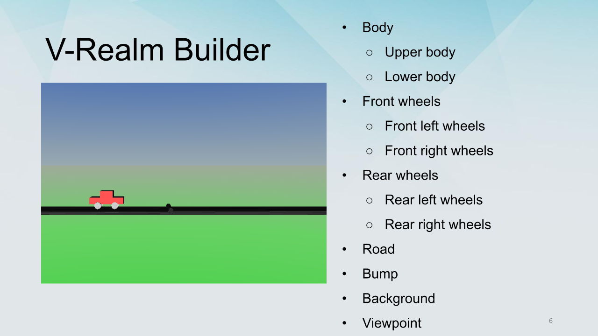

# CarOnBump

Virtual Reality Design of a  Car on a Bump  Using Simulink 3D Animation, this project was done by me, Joseph Abi Rizk and Rita Bechaalany.

# Explanation

---

---

---

---

---

---

---

